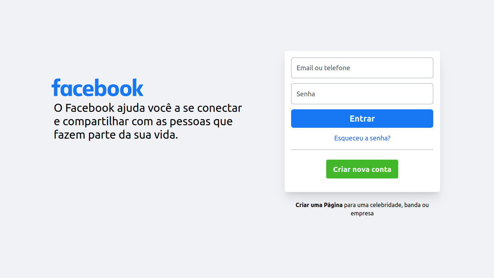

# 📡 Facebook - Tailwind

<p align="center">
  
</p>

## 💻 Projeto
Clone página de login do Facebook utilizando <a href="https://tailwindcss.com/">TailwindCSS</a>.

## 🎯 Executar
Você pode gerar o build do tailwind da seguinte forma:
```
npx tailwindcss build src/css/styles.css -o src/css/build.css
```
